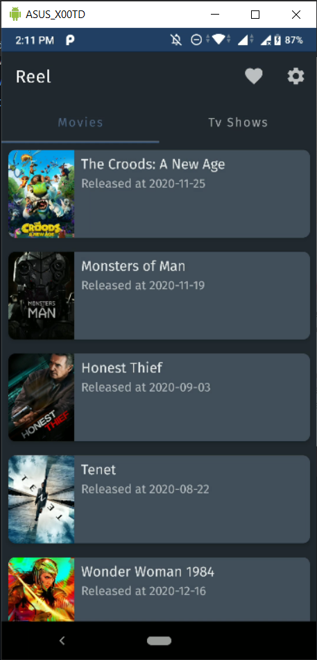
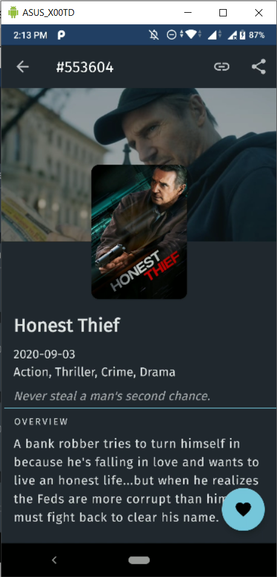
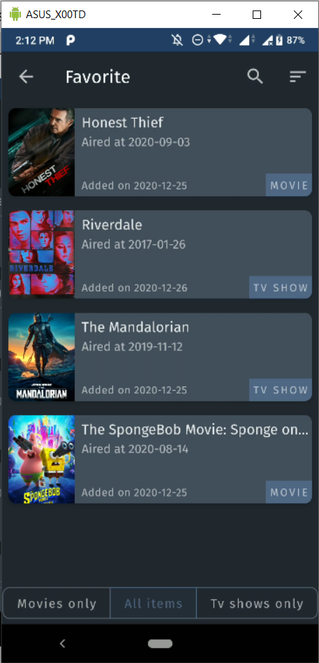
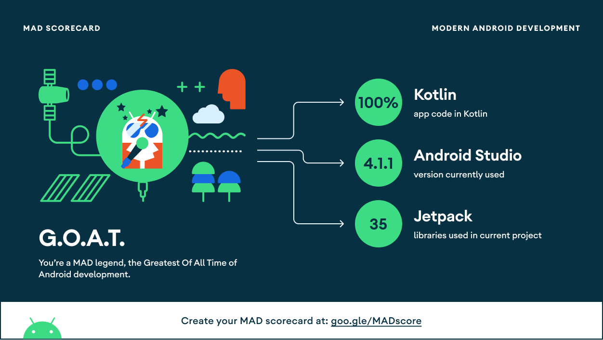

<!--
 Using https://github.com/othneildrew/Best-README-Template for this README~
-->

[![LinkedIn][linkedin-shield]][linkedin-url] 

<p align="center">
    
</p>
<h1 align="center">Reel</h1>

<!-- GETTING STARTED -->

## Panduan Memulai

Proyek ini menggunakan gradle. Untuk membuka proyek ini, gunakan
`gradlew build` command atau gunakan "Import Project" di Android Studio.

Data yang ada didalam aplikasi ini diambil dari internet, tepatnya di TMDB

Untuk itu, dibutuhkan api-key, yang bisa didapatkan dengan mendaftar ke TMDB

Setelah api-key didapatkan, simpan api-key tersebut di local.properties, supaya api key dapat dibaca oleh proyek ini.

```kotlin
tmdb.api.key="<API_KEY>"
```

<!-- MARKDOWN LINKS & IMAGES -->

<!-- https://www.markdownguide.org/basic-syntax/#reference-style-links -->

## Gambaran Umum

"Reel" merupakan aplikasi sederhana untuk melihat film ataupun acara tv yang sedang populer di dunia. Daftar film atau acara tv populer ini biasanya diperbarui setiap hari (dari TMDB) sehingga dibuatlah fitur favorite untuk menandai film atau acara tv yang datanya hanya akan tersimpan di aplikasi ini.

<div align="center">



</div>

## Teknologi yang Digunakan

- Min. SDK level 23

- [Kotlin Coroutines](https://github.com/Kotlin/kotlinx.coroutines) + [Flow](https://kotlin.github.io/kotlinx.coroutines/kotlinx-coroutines-core/kotlinx.coroutines.flow/) untuk **Reactive Programming**

- [Koin](https://github.com/InsertKoinIO/koin) untuk **Dependency Injection**

- JetPack library :
  
  - [Material-Components](https://github.com/material-components/material-components-android) untuk UI sesuai Material Guidelines
  
  - [Lifecycle](https://developer.android.com/jetpack/androidx/releases/lifecycle) untuk komponen yang 'sadar' android lifecycle
  
  - [Navigation](https://developer.android.com/jetpack/androidx/releases/navigation) untuk kemudahan navigasi antar view
  
  - [Room](https://developer.android.com/jetpack/androidx/releases/room) untuk membangun database SQLite
  
  - [Paging](https://developer.android.com/jetpack/androidx/releases/paging) untuk membuat paged list

- Architecture pattern :
  
  - MVVM - (Model - View via viewBinding - ViewModel)
  
  - Repository + UseCase pattern

- [Kotlin Serialization](https://github.com/Kotlin/kotlinx.serialization) untuk JSON parsing

- [Retrofit 2](https://github.com/square/retrofit) untuk mendapatkan data dari REST API

- [Coil](https://github.com/coil-kt/coil) untuk memuat gambar

- [Material Dialogs](https://github.com/afollestad/material-dialogs) untuk dialog builder

- [Timber](https://github.com/JakeWharton/timber) untuk logging

- **Modularization** 2 + 1 configuration ( [:core](core/), [:favorite](favorite/) + [:app](app/) )

- Kotlin DSL (.kts) + Gradle [buildSrc](buildSrc/) untuk Build Script

- [Gradle Plugin](buildSrc/src/main/kotlin/me/dicoding/bajp/reel/ReelCustomPlugin.kt) untuk Multi-Module Management

## MAD Score




[linkedin-shield]: https://img.shields.io/badge/-LinkedIn-black.svg?style=flat-square&logo=linkedin&colorB=555
[linkedin-url]: https://linkedin.com/in/alvarodwi